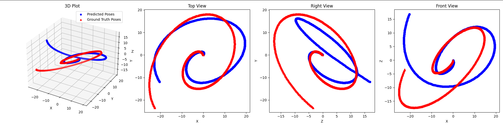
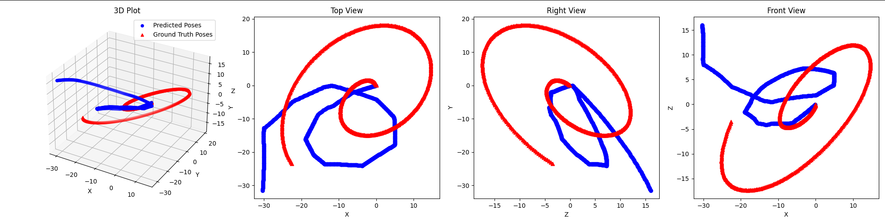
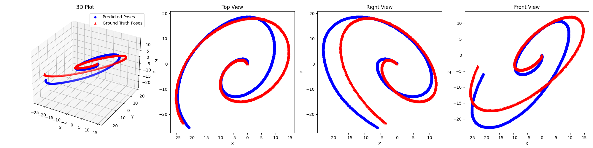

# Deep-Visual-Inertial-Odometry


This repository contains the codebase for Deep Visual-Inertial Odometry, which combines visual information from cameras and inertial measurements from IMUs using deep learning techniques to estimate the pose of a device in GPS-denied environments.

## Overview

Accurate pose estimation is critical for robotics and autonomous systems. Traditional VIO systems face challenges in dynamic and visually complex environments. This project leverages deep learning techniques, combining convolutional neural networks (CNNs) and Long Short-Term Memory (LSTM) networks, to improve pose estimation in VIO systems.

For more details on the methods and experiments, refer to the accompanying paper: *From Images to Inertia: Deep Learning’s Take on Visual-Inertial Odometry*.

## Table of Contents
- [Data Generation](#data-generation)
- [Training Models](#training-models)
  - [Inertial Odometry (IO)](#training-io)
  - [Visual Odometry (VO)](#training-vo)
  - [Visual-Inertial Odometry (VIO)](#training-vio)
- [Testing Models](#testing-models)
- [Contributing](#contributing)
- [License](#license)

---

## Data Generation

To generate the data required for training and testing, follow these steps:

1. Open the `data_generator` folder.
2. Open the file `datagen.blend` located in the `blend_files` directory using [Blender](https://www.blender.org/).
3. Run the provided script in Blender to simulate the drone trajectories and capture visual and inertial data.
4. The script will generate the dataset in the `data` directory with the following structure:

   ```text
   data/
   ├── camera_pose.txt      # Ground truth camera poses (position and orientation)
   ├── ref_imu_data.txt     # Reference IMU data (ideal IMU readings without noise)
   ├── real_imu_data.txt    # IMU data with added noise
   ├── trajectory.txt       # 3D coordinates of the simulated trajectory
   └── images/              # Image frames captured by the camera during simulation
       ├── 0001.jpg
       ├── 0002.jpg
       ├── ...
       └── 0100.jpg
   ```

---

## Training Models

Before training, ensure you have the dataset generated as described above and stored in the appropriate directory.

### Training IO

To train the Inertial Odometry (IO) model, use the following command:

```bash
python train.py --flag io --log_dir <log directory> --data_path <path to trajectory data>
```

Example:

```bash
python train.py --data_dir bent_spiral/ --log_dir IO_bs/ --flag io
```

### Training VO

To train the Visual Odometry (VO) model, use the following command:

```bash
python train.py --flag vo --log_dir <log directory> --data_path <path to trajectory data>
```

Example:

```bash
python train.py --data_dir bent_spiral/ --log_dir VO_bs/ --flag vo
```

### Training VIO

To train the Visual-Inertial Odometry (VIO) model, use the following command:

```bash
python train.py --flag vio --log_dir <log directory> --data_path <path to trajectory data>
```

Example:

```bash
python train.py --data_dir bent_spiral/ --log_dir VIO_bs/ --flag vio
```

---

## Testing Models

After training the models, you can test them using the following command:

```bash
python test.py --model_path <path to trained model> --data_path <path to test data>
```

Ensure the test data is formatted similarly to the training data.

---

## Results

Below are sample visualizations of model predictions versus ground truth:

| Inertial Odometry  | Visual Odometry  | Visual-Inertial Odometry  |
|--------------------|------------------|---------------------------|
|  |  |  |


---

## Contributing

Contributions are welcome! If you encounter any bugs or have suggestions for improvements, please open an issue or submit a pull request. When contributing, please ensure your code follows the project's style guidelines and includes appropriate tests.

---

## License

This project is licensed under the MIT License. See the [LICENSE](LICENSE) file for details.

---